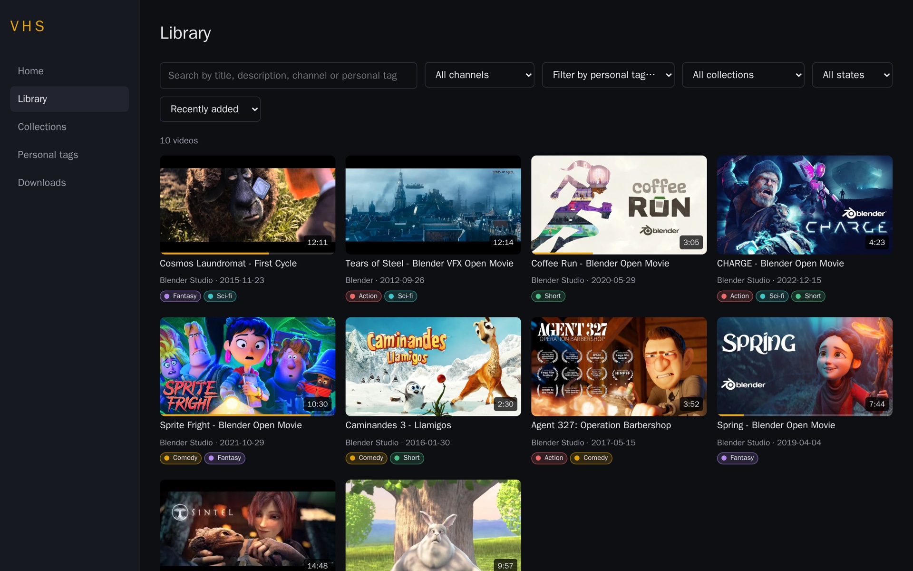
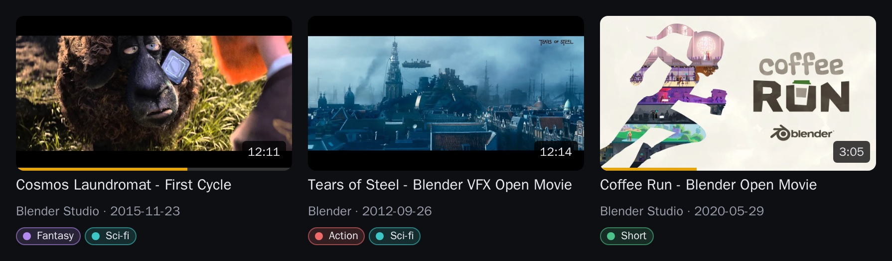
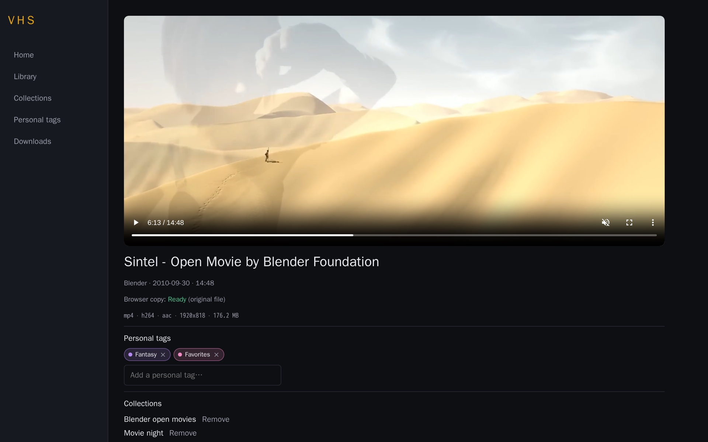
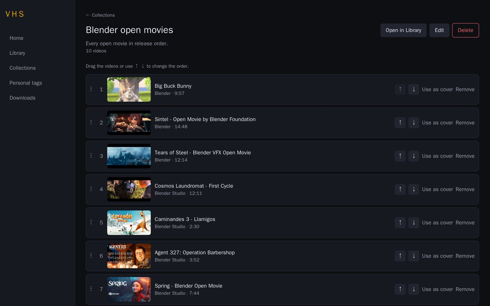
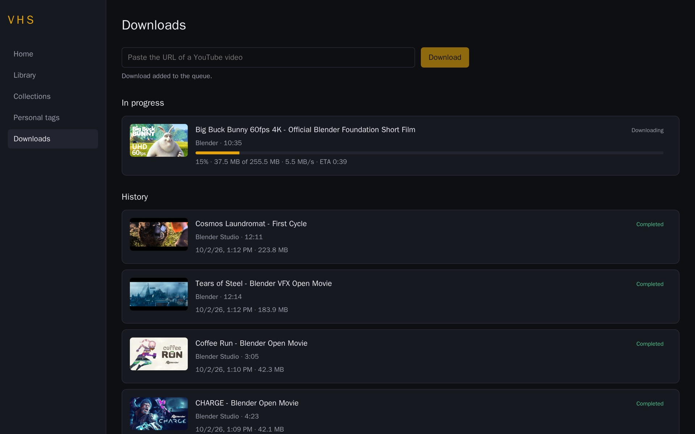

# VHS — Video Hoarding System

[](https://github.com/rocchidavide/vhs/actions/workflows/ci.yml)
[](LICENSE)

**Your own copy of the videos you care about.** VHS is a self-hosted video library: paste
the URL of a video, and it downloads it, archives it with its metadata on your own disk,
and lets you organize it and play it in the browser. Videos disappear from platforms;
the ones in VHS stay yours, on a server at home.

Supported platforms: YouTube and RaiPlay. VHS is built to support more.

> [!NOTE]
> **VHS is an early release (0.2).** It does one thing well: archive and play the videos
> you choose. Many features are deliberately not built yet (other platforms, playlist and
> channel subscriptions, platform cookies, Jellyfin integration), because what comes next
> should depend on what people actually need. If you try VHS, tell me what is missing or
> getting in your way in [Discussions](https://github.com/rocchidavide/vhs/discussions/categories/ideas);
> report bugs as [issues](https://github.com/rocchidavide/vhs/issues). See the
> [roadmap](#roadmap) for what is planned.



## Features

- **Download by URL** in the background, with progress, retries and recovery after a crash.
- **A safe archive:** each video is kept with its metadata (`.info.json`), thumbnail and
  SHA-256 checksum, in a folder layout readable without VHS. Files are added only when
  complete, and VHS never writes where its library folder is missing.
- **Pick up where you left off.** VHS remembers how far you got in every video: the
  player resumes from there, and a yellow bar under each thumbnail shows your progress
  across the whole library.
- **Play in the browser,** with seeking. Videos the browser cannot play are adapted; the
  original file is never modified.
- **Organize** with personal tags and ordered collections, separate from the platform's
  own tags and playlists.
- **Search and filter** by title, description, channel, tag or collection.
- **Verify, back up and restore** the library and the database with one command each.
- **Stays current:** the Home page announces new releases, and yt-dlp fixes for platform
  changes arrive as tested VHS releases.
- **Runs anywhere Docker does:** a Linux server, a NAS that runs Docker or a home
  computer, also over plain HTTP on a trusted local network.

**Where you left off, at a glance:** the yellow bar under a thumbnail is how much of it you
have watched.



<details>
<summary><strong>More screenshots</strong>: playback, collections, downloads</summary>

**Watching a video**: Sintel resumes at 6:13, where it was left, with its personal tags
and collections:



**A collection** in the order you choose:



**Downloads** in progress and the history:



</details>

## Why VHS?

The download itself is done by [yt-dlp](https://github.com/yt-dlp/yt-dlp): VHS is
everything that comes after it. It is a library for the videos you choose one by one,
kept on your disk with their metadata and checksums, played in the browser where you
left off, organized your way, verified and backed up.

Other good projects cover nearby needs, and may suit you better:

- [MeTube](https://github.com/alexta69/metube) is a web interface for yt-dlp: it downloads
  into a folder, without a library to browse and play;
- [Tube Archivist](https://github.com/tubearchivist/tubearchivist) and
  [Pinchflat](https://github.com/kieraneglin/pinchflat) archive whole channels and
  playlists automatically, which VHS does not do yet (subscriptions are on the
  [roadmap](#roadmap));
- [Jellyfin](https://jellyfin.org/) and Plex play a media collection, but do not
  download it.

VHS focuses on a personal collection with care for your data (complete files only,
checksums, read-only verification, verified backups), no lock-in (plain folders that stay
readable without VHS) and a light stack.

## Under the hood

VHS is a small project built like a system meant to last: every choice below is
documented, and most are enforced by tests.

- **API-first.** The Vue interface is just one client of a REST API (`/api/v1/`, with an
  OpenAPI description), so other clients can follow.
- **Clear layers with enforced boundaries.** API, services, background tasks, the
  download engine and storage each have one job. The engine does not depend on Django,
  and a test fails if it ever does.
- **Your files come first.** Downloads are written to a work area and promoted with an
  atomic hard link that never overwrites anything; each file is checksummed. VHS writes
  only into a library folder marked as its own, never deletes your files automatically,
  and its verification is read-only. [Data safety](docs/data-safety.md) lists every
  guarantee, the tests behind it and its limits.
- **Recovers by itself.** Every task can be run again safely; heartbeats and a
  reconciliation every 5 minutes resume interrupted work and clean up after a crash.
- **Protected media.** Django checks who may watch; Nginx streams the file with
  `X-Accel-Redirect`, so seeking is fast. Symbolic links are refused at both levels,
  verified end to end.
- **No lock-in.** The library is plain folders (platform, channel, date and title) with
  the original metadata in `.info.json` files: it stays readable without VHS.
- **Tested releases.** Every release ships ready-made images for x86_64 and arm64, built
  once and checked by installing VHS from the release on both: every installation of a
  version runs exactly those images. `./vhs update` moves to the next release without
  touching your settings.
- **Tested and documented.** 350+ backend tests (media integration with ffmpeg
  included), frontend tests and lint run on every change in CI; installs are verified on
  real Linux systems. The [architecture](docs/architecture.md) and the
  [storage decisions](docs/storage-decisions.md) record the reasons, the trade-offs and
  what was tried and set aside.
- **Ready for other languages.** All interface texts go through i18n; English is the
  first language.

## Quick start

You need Docker with Compose 5.4 or later, curl and tar; rsync for backups
([requirements](docs/installation.md#requirements)). On the server, download the latest
release into a new folder:

```bash
mkdir vhs && cd vhs
curl -fsSL https://github.com/rocchidavide/vhs/releases/latest/download/vhs.tar.gz | tar xz
```

(or [download vhs.tar.gz](https://github.com/rocchidavide/vhs/releases/latest/download/vhs.tar.gz)
and extract it on your server). Then prepare the video folder:

```bash
sudo mkdir -p /srv/vhs/library && sudo chown 1000:1000 /srv/vhs/library
```

```bash
cp .env.example .env
```

Edit `.env` (secret key, addresses, database password), then:

```bash
./vhs start
```

```bash
./vhs create-user
```

and open `http://<your-server>:1976/` (1976: the year VHS tapes came out). The [installation guide](docs/installation.md) explains
every step, HTTPS, backups and updates; VHS has been tested on Ubuntu Server 26.04,
Linux Mint 22.2 and macOS ([tested environments](docs/installation.md#tested-environments)).

## Roadmap

VHS 0.2 covers on-demand downloads, the library, playback, local organization, file
verification and backups, installed and updated from tested releases. Planned next: more
platforms, platform cookies, subscriptions to channels and playlists,
Jellyfin integration, network storage (NFS, SMB, NAS) and more automation. Details and
decisions are in §39 of [architecture.md](docs/architecture.md).

## Documentation

- **[Installing VHS](docs/installation.md)**: requirements, tested environments,
  configuration, HTTPS, library verification, backup and restore, updates.
- **[Developing VHS](docs/development.md)**: the development environment (everything runs
  in containers, through `./dev`), tests, debugging, translations.
- **[Data safety](docs/data-safety.md)**: what VHS guarantees about your videos and data,
  how it is tested, and what it cannot protect you from.
- [Architecture](docs/architecture.md), [conventions](docs/conventions.md) and
  [storage and backup decisions](docs/storage-decisions.md).

## Contributing

Ideas and questions are welcome in [Discussions](https://github.com/rocchidavide/vhs/discussions),
bug reports and pull requests as described in [CONTRIBUTING.md](CONTRIBUTING.md).
To report a security problem, see [SECURITY.md](SECURITY.md).

## Responsible use

VHS is meant for a personal archive of videos you are allowed to keep. You are responsible
for what you download and how you use it: respect the terms of service of the platforms
and the rights of the content owners. VHS does not redistribute content and is not
affiliated with YouTube, RAI or any other platform.

## License

VHS is released under the [MIT License](LICENSE).

The screenshots show open movies by the [Blender Foundation](https://studio.blender.org/films/)
(Big Buck Bunny, Sintel, Tears of Steel, Cosmos Laundromat, Caminandes, Agent 327,
Spring, Coffee Run, Sprite Fright, Charge), released under Creative Commons Attribution
licenses.
